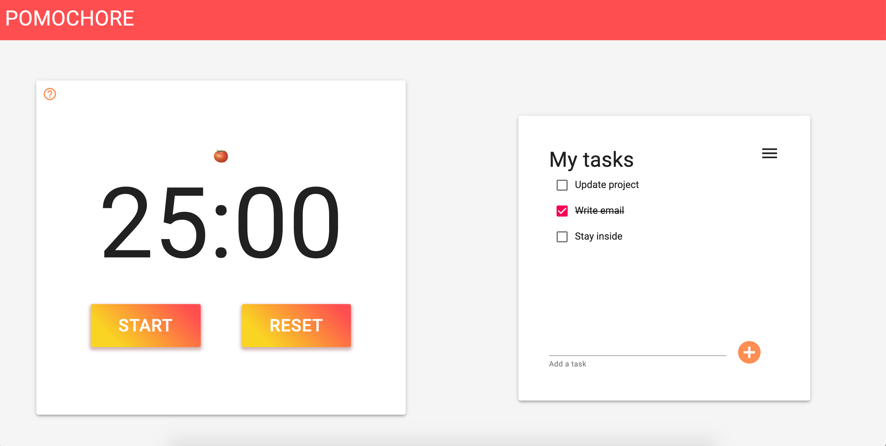
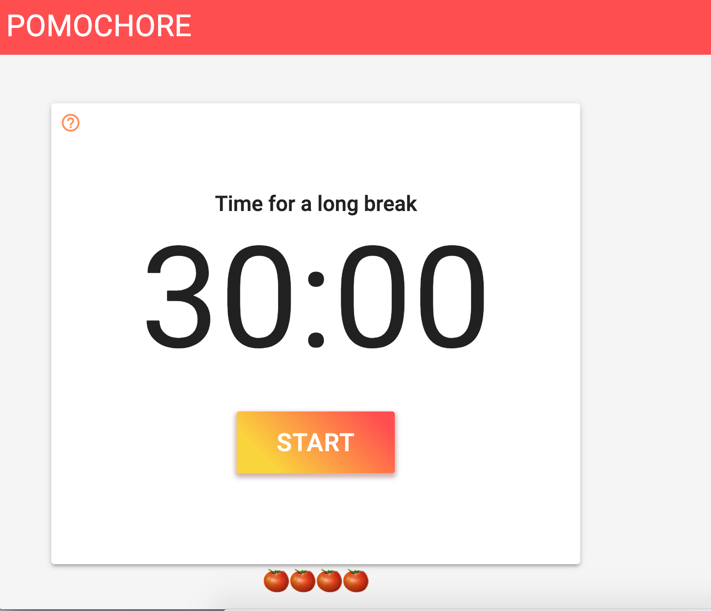
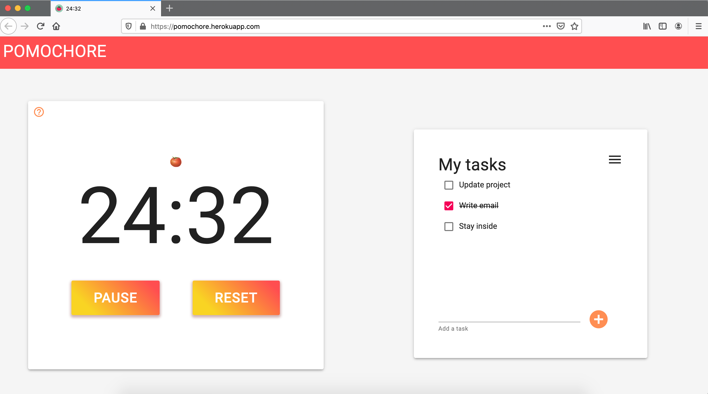
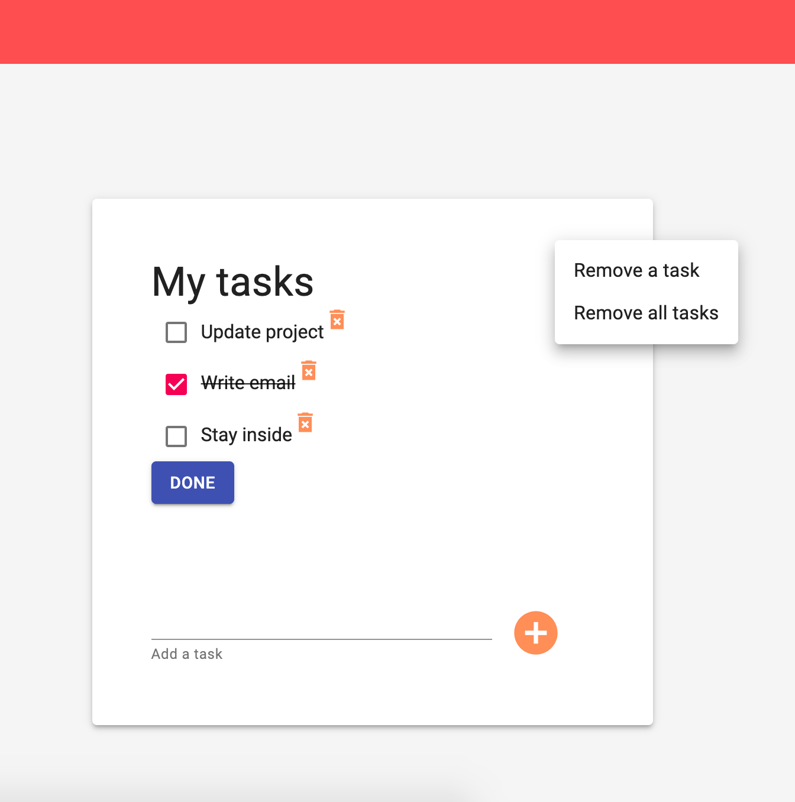

# Pomochore
Because having a productive day can be difficult (especially when you have to work from home), I created a website with a Pomodoro timer and a list of tasks. I used test-driven development and Redux for state management.



# Built with:
* React
* Redux
* Enzyme
* Jest
* Material-UI

# Deployment
The website is deployed on Heruko and can be found [here](https://pomochore.herokuapp.com/).

# Getting started
Clone or download the repo. Run `yarn` from the root directory and then run `yarn start`. The project will run on localhost:3000.

# Pomodoro timer
The Pomodoro technique is a time management method created by Francesco Cirillo. It uses a timer which is set to 25 minutes. Before you start, you decide the task you want to work on. After a session (which is called a 'pomodoro' after the tomato-shaped kitchen timer Cirillo used), you get either a short (5 minutes) or long break (30 minutes). This depends on how many sessions you have done. After 4 pomodoros, you get a long break:




I used Helmet to manage the document head. That way, the timer is shown in the tab bar even when users are not focused on the Pomochore website. 



## Testing
I build the Pomodoro timer using test-driven development. Most tests were straightforward, but because I'm using intervals for the timer I did run into a few problems. In the end, I was able to test the timers with Jest's timer mocks. Jest makes it possible to for example test whether the time actually decreases when the start button has been clicked:

```javascript
it('time decreases by 1 second when clicking start button', () => {
  // find button and click
  let startButton = findByTestAttr(wrapper, 'start-button').first()
  startButton.simulate('click')

  // check value after 1 second on display
  act(() => jest.advanceTimersByTime(1000))
  const timeDisplay = findByTestAttr(wrapper, 'time-display')
  expect(timeDisplay.text()).toContain('24:59')
})
```

# Task list
Users can add tasks to their list and mark these as done when they're finished. I created one reducer function to perform all of the actions. For example, to add a task to the list, I created a copy of the to do list and then pushed the new task to that copy:

```javascript
const todoReducer = (todoList = [], action) => {
  if (action.type === 'ADD_TODO') {
    const updatedArray = [...action.todoArray]
    updatedArray.push(action.todo)
    return updatedArray
  }
  ...
}
```

It's also possible to remove one or all tasks via the menu in the task list container. When a user clicks on 'Remove a task', icons of bins are shown next to each task. When finished, the user clicks on 'Done' to hide these bins again.



All of the tasks on the list are saved in local storage and shown when the user returns to the website. Each time the component is updated, which happens when a task is created or removed, the current list of tasks is saved in local storage. When the component mounts, so when the website renders for the first time, I check if there is an array with items in local storage and then set the state of the task list to equal to that array:

```javascript
componentDidMount() {
  const localTodo = JSON.parse(localStorage.getItem('todolist'))
  if (localTodo) {
    this.props.setLocalTodo(localTodo)
  }
}

componentDidUpdate() {
  localStorage.setItem('todolist', JSON.stringify(this.props.todoList))
}
```

# Wins & challenges
* It was great to learn more about testing React with Enzyme and Jest. At first, it was a challenge to test the timer as it was hard to re-create the passing time. But when I'd learned more, it was a lot of fun playing around with Jest to create mock timers.
* One of my main wins was using Redux for state management as I've always wanted to learn more about this library. I think it's a great way to interact with the state of an app. It made it especially easier to use the same data in several components, like the number of pomodoros and setting the minutes and seconds of the timer. 

# Future improvements
* I want to add the option to play a sound when the time is up, so users know when they should take a break or start working again.
* To improve productivity even further, I would also like to show a progress bar of the completed tasks/the total amount of tasks. That way, it's easier for users to see their progress.